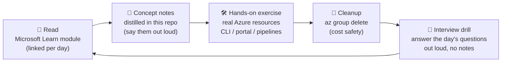
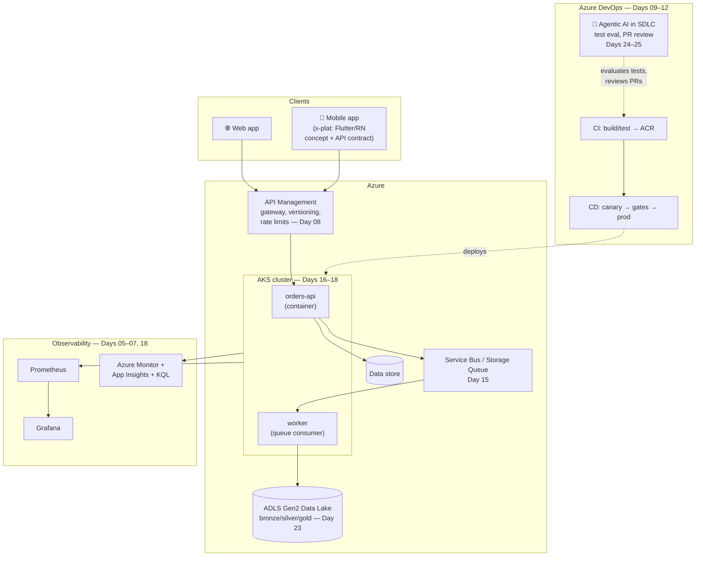

# SRE Track — Site Reliability Engineering, DevOps & Distributed Systems on Azure

A hands-on companion to Microsoft Learn's
[AZ-400: Develop an SRE strategy](https://learn.microsoft.com/en-us/training/paths/az-400-develop-sre-strategy/)
learning path — **customized to a real Lead/SRE Engineer job description**: distributed
systems, containers & Kubernetes, IaC, observability (Prometheus/Grafana), API design,
data lakes, and agentic AI in the SDLC.

**You read the theory on Microsoft Learn → you do the hands-on work here, in this repo, against real Azure resources.**

---

## How This Track Works



**Daily time:** 45–75 min. **Cost discipline:** every exercise deploys into `rg-sre-dayXX`
and ends with cleanup. Read [docs/azure-setup-and-cost-safety.md](docs/azure-setup-and-cost-safety.md) **before Day 04**.

---

## Your Target Job Description → This Track

Every requirement in the posting, mapped to where you learn and *prove* it:

| Job requirement | Where you build it | Proof you can show |
|---|---|---|
| Distributed systems: microservices, REST APIs, message queues | Days 08, 15, 21–22 | Two services talking via API + queue, deployed |
| Scalability, fault tolerance, load balancing (deep) | Days 13–15, 20 | Autoscale rules firing under load; chaos experiment results |
| Containers (Docker, Kubernetes) | Days 16–18 | Image in ACR, app running on AKS, K8s manifests in git |
| CI/CD + Infrastructure as Code | Days 09–12, 19 | YAML pipelines in Azure DevOps; Bicep templates |
| Observability: Prometheus, Grafana, (ELK concepts) | Days 05–07, 18 | Grafana dashboards over Prometheus metrics from AKS |
| API design, integration, optimization | Day 08 + capstone | Versioned REST API with rate limiting via APIM |
| Data lakes & scaled data systems | Day 23 | ADLS Gen2 with bronze/silver/gold layout |
| Agentic AI in the SDLC | Days 24–25 + daily | Copilot/agents in pipeline; AI test evaluation story |
| SRE strategy (AZ-400 path) | Days 01–07, 26–28 | SLO dashboard, postmortem doc, game-day story |
| Full-stack + x-plat mobile (Flutter/React Native) awareness | Day 08 notes + optional extension | Talking points; architecture diagram with mobile edge |
| Mentoring & communication (leadership) | Day 29 + every out-loud drill | Your out-loud answers; capstone write-up |

---

## The Big Picture — The System You'll Build

By the capstone you'll have built and operated this — a reference architecture
you can whiteboard in interviews:



---

## Roadmap — 30 Days, 6 Phases

```mermaid
flowchart LR
    subgraph P1["1 · SRE Foundations"]
        D01["Day 01<br/>What is SRE"]
        D02["Day 02<br/>SLI/SLO/<br/>error budgets"]
        D03["Day 03<br/>Toil &<br/>automation"]
        D04["Day 04<br/>Azure setup &<br/>cost guardrails"]
    end
    subgraph P2["2 · Observability"]
        D05["Day 05<br/>Azure Monitor<br/>+ VMs"]
        D06["Day 06<br/>App Insights<br/>instrumentation"]
        D07["Day 07<br/>KQL + SLO<br/>dashboard"]
    end
    subgraph P3["3 · DevOps & Delivery"]
        D08["Day 08<br/>API design +<br/>APIM gateway"]
        D09["Day 09<br/>Azure DevOps<br/>org/repo/boards"]
        D10["Day 10<br/>CI pipeline<br/>(YAML)"]
        D11["Day 11<br/>Release strategy<br/>blue-green/canary"]
        D12["Day 12<br/>CD with gates<br/>+ feature flags"]
    end
    subgraph P4["4 · Resilience & Distributed Systems"]
        D13["Day 13<br/>Elasticity &<br/>autoscale"]
        D14["Day 14<br/>Retry/backoff/<br/>circuit breaker (code)"]
        D15["Day 15<br/>Load balancing +<br/>message queues"]
        D19["Day 19<br/>IaC with Bicep"]
        D20["Day 20<br/>Chaos<br/>engineering"]
    end
    subgraph P5["5 · Containers & Kubernetes"]
        D16["Day 16<br/>Docker → ACR"]
        D17["Day 17<br/>AKS deep dive"]
        D18["Day 18<br/>Prometheus +<br/>Grafana"]
    end
    subgraph P6["6 · Data, AI & Incidents"]
        D21["Day 21<br/>Distributed<br/>systems theory"]
        D22["Day 22<br/>Messaging<br/>patterns"]
        D23["Day 23<br/>Data lakes<br/>(ADLS Gen2)"]
        D24["Day 24<br/>Agentic AI<br/>in the SDLC"]
        D25["Day 25<br/>AI quality<br/>evaluation"]
        D26["Day 26<br/>Incident mgmt<br/>& on-call"]
        D27["Day 27<br/>Blameless<br/>postmortems"]
        D28["Day 28<br/>Game day"]
        D29["Day 29<br/>Leadership &<br/>communication"]
        D30["Day 30<br/>🏆 Capstone"]
    end
    P1 --> P2 --> P3 --> P4 --> P5 --> P6
```



### Phase → Microsoft Learn mapping

| Phase | Days | Microsoft Learn material (read online) |
|-------|------|----------------------------------------|
| 1 · SRE Foundations | 01–04 | [Introduction to SRE](https://learn.microsoft.com/en-us/training/modules/intro-to-site-reliability-engineering/) (all 7 units) |
| 2 · Observability | 05–07, 18 | [Monitor Azure VMs with Azure Monitor](https://learn.microsoft.com/en-us/training/modules/monitor-azure-vm-using-diagnostic-data/) · [Manage site reliability](https://learn.microsoft.com/en-us/training/modules/manage-site-reliability/) · [AZ-400: Implement continuous feedback](https://learn.microsoft.com/en-us/training/paths/az-400-implement-continuous-feedback/) |
| 3 · DevOps & Delivery | 08–12 | [AZ-400: CI with Azure Pipelines & GitHub Actions](https://learn.microsoft.com/en-us/training/paths/az-400-implement-ci-azure-pipelines-github-actions/) · [Design & implement a release strategy](https://learn.microsoft.com/en-us/training/paths/az-400-design-implement-release-strategy/) · [Implement secure continuous deployment](https://learn.microsoft.com/en-us/training/paths/az-400-implement-secure-continuous-deployment/) |
| 4 · Resilience | 13–15, 19–20 | [Scale cloud resources with elasticity](https://learn.microsoft.com/en-us/training/modules/cmu-cloud-elasticity/) · [Build applications on the cloud](https://learn.microsoft.com/en-us/training/modules/cmu-build-apps-cloud/) · [AZ-400: Manage infrastructure as code](https://learn.microsoft.com/en-us/training/paths/az-400-manage-infrastructure-as-code-using-azure/) |
| 5 · Containers & K8s | 16–18 | [Introduction to Kubernetes on Azure](https://learn.microsoft.com/en-us/training/paths/intro-to-kubernetes-on-azure/) · container build strategy in the AZ-400 CI path |
| 6 · Data, AI & Incidents | 21–30 | [Manage site reliability — blameless postmortem unit](https://learn.microsoft.com/en-us/training/modules/manage-site-reliability/) · Azure Chaos Studio docs · Microsoft Foundry / Copilot docs |

---

## Progress Tracker

**Phase 1 — SRE Foundations**
- [ ] **Day 01** — What is SRE · [day-01-what-is-sre](day-01-what-is-sre/README.md)
- [ ] **Day 02** — SLIs, SLOs & error budgets · [day-02-sli-slo-error-budget](day-02-sli-slo-error-budget/README.md)
- [ ] **Day 03** — Toil, automation & the SRE mindset
- [ ] **Day 04** — Azure setup, cost guardrails, your lab subscription

**Phase 2 — Observability**
- [ ] **Day 05** — Azure Monitor: metrics & VM insights
- [ ] **Day 06** — Application Insights: instrument a live app
- [ ] **Day 07** — KQL, Log Analytics & SLO dashboard

**Phase 3 — DevOps & Delivery**
- [ ] **Day 08** — API design + API Management gateway
- [ ] **Day 09** — Azure DevOps: org, project, repo, boards
- [ ] **Day 10** — CI pipeline in YAML (build + test a real service)
- [ ] **Day 11** — Release strategies: blue-green, canary, rings
- [ ] **Day 12** — CD with approvals, gates & feature flags

**Phase 4 — Resilience & Distributed Systems**
- [ ] **Day 13** — Elasticity: autoscale rules under real load
- [ ] **Day 14** — Fault tolerance in code: retry, backoff, circuit breaker
- [ ] **Day 15** — Load balancing + message queues (decoupling)
- [ ] **Day 19** — Infrastructure as Code with Bicep
- [ ] **Day 20** — Chaos engineering with Azure Chaos Studio

**Phase 5 — Containers & Kubernetes**
- [ ] **Day 16** — Docker: build, tag, push to ACR
- [ ] **Day 17** — AKS: deploy, scale, self-heal
- [ ] **Day 18** — Prometheus + Grafana on AKS

**Phase 6 — Data, AI & Incidents**
- [ ] **Day 21** — Distributed systems theory: CAP, consistency, idempotency
- [ ] **Day 22** — Messaging patterns: queues, pub/sub, exactly-once myths
- [ ] **Day 23** — Data lakes & scaled data systems (ADLS Gen2)
- [ ] **Day 24** — Agentic AI in the SDLC (Copilot/agents in your pipeline)
- [ ] **Day 25** — AI quality evaluation for generated code/tests
- [ ] **Day 26** — Incident management & on-call simulation
- [ ] **Day 27** — Blameless postmortems (write a real one)
- [ ] **Day 28** — Game day: inject failure, detect, respond, write it up
- [ ] **Day 29** — Leadership: mentoring, estimation, executive communication
- [ ] **Day 30** — 🏆 Capstone: the full system + your interview story bank

---

## Interview Angle

Every day ends with **"say it out loud"** questions from real SRE/lead interviews.
Full bank with model answers: [docs/interview-questions.md](docs/interview-questions.md).

The 6 questions that decide these interviews:

1. *"SLI vs SLO vs SLA?"* → Day 02
2. *"How do you decide what to alert on?"* → Day 07
3. *"Deploy to production with zero downtime — walk me through it."* → Day 11
4. *"Design a system that survives a datacenter outage."* → Days 13–15, 20
5. *"How have you used AI in your development workflow?"* → Days 24–25
6. *"Tell me about a time you led an incident response."* → Days 26–28 (you'll have a real story)

---

## Repo Layout

```
sre-track/
├── README.md                          ← you are here (visual roadmap)
├── docs/
│   ├── sre-curriculum.md              ← day-by-day detail: reading, concepts, exercises
│   ├── azure-setup-and-cost-safety.md ← free tier, az login, cleanup rules — READ FIRST
│   └── interview-questions.md         ← question bank with model answers
└── day-XX-<topic>/
    ├── README.md                      ← reading links + concept notes + exercise steps
    └── (scripts, KQL, pipeline YAML, Bicep, Dockerfiles, or code as needed)
```
