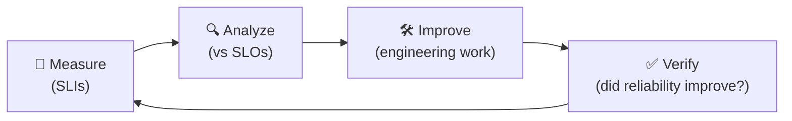

# Day 01 — What is SRE (and Why Interviews Care)

**Time:** 45–60 min | **Phase:** 1 · Foundations | **Cost:** $0

---

## 📖 Reading (do this first, online)

[Introduction to Site Reliability Engineering (SRE)](https://learn.microsoft.com/en-us/training/modules/intro-to-site-reliability-engineering/) — units 1–4:

1. Introduction
2. What is SRE and why does it matter?
3. SRE in context
4. Key SRE principles and practices: virtuous cycles

## 📝 Concept Notes (distilled — verify against your reading)

**The one-sentence definition (memorize):**
> "SRE is what happens when you ask a software engineer to design an operations function." — Google

**SRE vs. DevOps vs. traditional ops:**

| | Traditional Ops | DevOps | SRE |
|---|---|---|---|
| Core idea | Keep it running, change is risk | Dev + Ops collaborate, automate delivery | Engineering discipline for reliability |
| Success metric | Uptime (reactive) | Deployment frequency, lead time | SLO compliance, error budget, toil % |
| Attitude to change | Resist it | Enable it | Enable it *within an error budget* |
| Failure handling | Post-incident ticket | Continuous feedback | Blameless postmortem + budget policy |

**Key relationship:** DevOps is the philosophy/culture; SRE is a concrete
*implementation* of it with specific practices (SLOs, error budgets, toil caps).
Interview-safe phrasing: **"SRE implements DevOps."**

**The virtuous cycle:**



## 🛠️ Exercise — SRE Self-Assessment (no Azure today)

Open [self-assessment.md](self-assessment.md) and fill it in. It asks you to:

1. Score a system you know (current/past project, or this repo) against 8 SRE practices
2. Identify the 3 biggest reliability gaps
3. Write your personal learning objectives mapped to the target job description

This is not busywork — **your answers become interview material.** "In my current
environment we had no SLOs and alert fatigue; here's how I'd fix it" is a
complete answer to "how would you improve our reliability practice?"

## 🎤 Interview Drill (say these out loud, no notes)

1. What is SRE, in one sentence?
2. How does SRE relate to DevOps?
3. Why does treating "100% uptime" as the goal actually harm a business?
4. What's the virtuous cycle of SRE practice?

## ✅ Done?

- [ ] Read units 1–4 on Microsoft Learn
- [ ] Completed self-assessment.md
- [ ] Answered all 4 drill questions out loud
- [ ] Check Day 01 off in [../README.md](../README.md)

```bash
git add sre-track && git commit -m "SRE Day 01: what is SRE + self-assessment"
```
