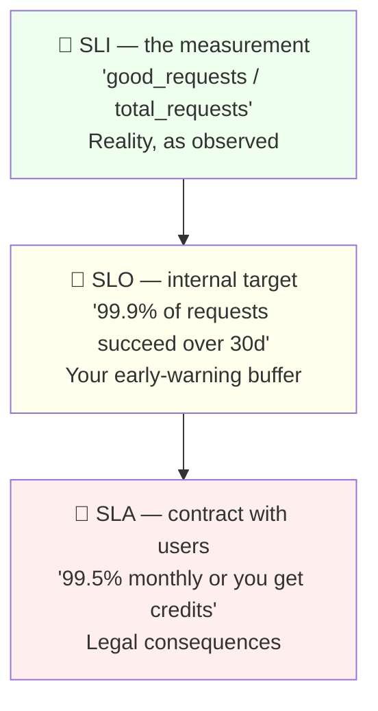

# Day 02 — SLIs, SLOs & Error Budgets

**Time:** 60–75 min | **Phase:** 1 · Foundations | **Cost:** $0

---

## 📖 Reading (online)

1. [Introduction to SRE](https://learn.microsoft.com/en-us/training/modules/intro-to-site-reliability-engineering/) — units 5–7 (human side, getting started, summary)
2. [Azure Well-Architected: reliability metrics & SLOs](https://learn.microsoft.com/en-us/azure/well-architected/reliability/metrics) (skim)

## 📝 Concept Notes

**The hierarchy (draw this from memory):**



**Why SLO < SLA < 100%:** the gap between SLO and SLA is your safety buffer;
the gap between your SLO and 100% is your **error budget** — permission to take risks.

**Error budget math (know this cold):**

```
SLO = 99.9% over 30 days
Budget = 0.1% of requests (or time)
If the service handles 43.2M requests/30d → budget = 43,200 failed requests
Equivalent: 99.9% monthly ≈ 43.2 minutes of downtime allowed
```

**Burn rate** = how fast you're consuming the budget. Burn rate > 1 sustained
means you'll miss the SLO. This is the basis of smart alerting (Day 07).

**Good SLI checklist ("the happiness test"):**
- Measures what the *user* experiences, not internal state
- Ratio of good events / total events (0–100%, easy to reason about)
- Measurable continuously, cheap to compute
- Changes meaningfully when users are unhappy

**Common SLIs by service type:**

| Service type | Classic SLIs |
|---|---|
| Request/response (API) | availability (error rate), latency (p95/p99) |
| Queue/pipeline | freshness (age of oldest item), throughput |
| Storage | durability, availability, latency |

## 🛠️ Exercise — Error Budget Calculator (Python)

[exercise_error_budget.py](exercise_error_budget.py) — fill in the TODOs.
You'll compute budget windows, downtime equivalents, burn rates, and answer the
question product managers actually ask: **"can we ship this risky thing this week?"**

```bash
python3 exercise_error_budget.py
```

## 🎤 Interview Drill (out loud, no notes)

1. SLI vs SLO vs SLA — and where does the error budget live?
2. Why is 100% the wrong reliability target?
3. Your service has a 99.9% monthly SLO and burned 80% of budget by day 10. What happens now?
4. Give a good SLI and a bad SLI for a REST API. Defend both choices.

## ✅ Done?

- [ ] Read the units + skimmed Well-Architected metrics doc
- [ ] All TODOs in exercise_error_budget.py complete and tests pass
- [ ] Can recite: 99.9% monthly ≈ 43.2 min downtime; 99.99% ≈ 4.3 min
- [ ] Answered drill questions out loud
- [ ] Check Day 02 off in [../README.md](../README.md)

```bash
git add sre-track && git commit -m "SRE Day 02: SLIs, SLOs, error budget calculator"
```
